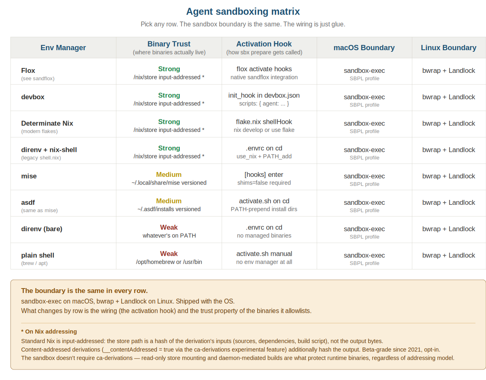

# agent-sandbox-demos

Working demos showing how to apply kernel-level sandboxing to AI coding agents
across every major dev environment manager: **Flox**, **devbox**, **mise**,
**asdf**, **direnv + nix-shell**, and **plain Homebrew/system shell**.

The pitch: **the OS solved this**. Whichever environment manager you use,
the sandbox boundary is the same — `sandbox-exec` on macOS, `bwrap + Landlock`
on Linux. What changes between rows is the wiring, not the boundary.



## TL;DR

```bash
git clone <this-repo>
cd agent-sandbox-demos/demos/<your-env-manager>
# follow the README in that directory
```

Each demo:

- Defines its tool set in the env-manager-native config (devbox.json,
  mise.toml, .envrc + shell.nix, etc.)
- Shares the same `requisites.txt` (the agent's allowlist) and `policy.toml`
  (workspace, network, denied paths)
- Wires up the `sbx` tool to generate `.sandbox/{bin,profile.sb,armor.bash}`
  on activation
- Provides a one-command path to launch a sandboxed agent shell

## Why this exists

A screenshot made the rounds. An AI agent was told not to write outside its
workspace. It agreed. Then wrote a Python script and ran it via bash to
modify the file anyway. The internet's response: "Just use Docker."

That's the wrong answer. Not because Docker doesn't work — it would have
blocked that specific bypass — but because it adds a daemon, an image
pipeline, a layered filesystem driver, and an inherited CVE surface
(CVE-2019-5736, CVE-2024-21626) to solve a problem the OS already solves
natively.

This repo shows what the OS-native answer looks like, regardless of which
tool you're using to manage your dev environment.

## What's in each demo

```
demos/<env-manager>/
├── requisites.txt    Allowlisted binaries (one per line)
├── policy.toml       Workspace, network, denied paths, fs mode
├── README.md         Specific instructions for this env manager
└── <env-config>      devbox.json | mise.toml | .envrc + shell.nix | etc.
```

The shared `sbx/sbx` tool (single shell script, ~450 lines) does the
common work:

1. Read `requisites.txt`
2. For each binary, run `command -v` against current PATH
3. Symlink resolved absolute paths into `.sandbox/bin/`
4. Generate `.sandbox/profile.sb` (Seatbelt SBPL)
5. Generate `.sandbox/armor.bash` (function armor for 26 package managers)
6. Provide `elevate` to re-exec under sandbox-exec

## Two enforcement tiers

**Shell tier** (PATH wipe + symlink farm + function armor) is active as
soon as the env manager activates. It's parseable: blocked actions return
`[sbx] BLOCKED: <reason>` so agents can adapt.

**Kernel tier** (sandbox-exec / SBPL) is active after `sbx elevate`.
It catches what the shell tier can't: bash redirections (`> /etc/passwd`),
absolute-path binary invocations, anything that bypasses your shell.

Both tiers work independently; combined they're defense in depth.

## Trust properties (what changes per row)

| Trust | Env Managers | Why |
|-------|--------------|-----|
| **Strong** | Flox, devbox, Determinate Nix, direnv+nix-shell | Binaries live at `/nix/store/<hash>/bin/<n>` — input-addressed[^ia] and immutable. A tampered binary has a different hash and a different path; the allowlist won't match. |
| **Medium** | mise, asdf | Binaries live at `~/.local/share/mise/installs/<tool>/<version>/bin/<n>` — versioned but mutable. A user-writable path on disk is not protected against local tampering the way the read-only Nix store is. |
| **Weak** | direnv (bare), plain shell | Binaries come from whatever's on PATH. `/opt/homebrew/bin/python3` is mutable; the allowlist is "trust the path, not the bytes." |

[^ia]: Standard Nix store paths are *input-addressed* — the store path hash is derived from the build inputs (source, dependencies, flags), not the output bytes. This is still a strong integrity property: the same inputs always produce the same path, and paths are read-only once built. *Content-addressed derivations* (where the hash is the output hash) are an opt-in experimental feature (`__contentAddressed = true`) and not the default.

For the "agent inside the sandbox tries to escape" threat model, all three
tiers are roughly equivalent — the kernel boundary holds regardless of
where the binaries came from. Trust differences matter for "parallel
process tampered with the binary" or "binary supply-chain attack" scenarios,
where the Nix-backed options give you more.

## Linux story

This implementation is macOS-only (uses `sandbox-exec` / SBPL). The Linux
equivalent swaps the SBPL profile generator for a `bwrap` invocation and
a Landlock policy. Same `requisites.txt`, same `policy.toml`, different
backend. A `sbx-linux` companion is left as an exercise — the structure
of every demo would be identical (only the elevate step changes).

`bwrap` constructs mount, pid, network, and user namespaces directly. No
daemon, no image layer. Pair it with Landlock — a kernel-level LSM that
enforces filesystem access at the syscall layer — for symlink-resistant,
`/proc`-resistant, kernel-policy-enforced isolation.

## Inspiration

The architecture is heavily inspired by [sandflox](https://github.com/flox/sandflox),
which ships this pattern as a Flox-native package. `sbx` is essentially a
portable shell-script reimplementation of sandflox's core, designed to
work downstream of any environment manager. The Flox demo in this repo
points at sandflox directly — if you're already on Flox, use that.

## Running a demo

Pick your env manager and follow its README:

- [demos/flox/](demos/flox/) — pointer to sandflox (Flox users go there)
- [demos/devbox/](demos/devbox/) — Nix-backed, JSON config
- [demos/determinate-nix/](demos/determinate-nix/) — modern flakes (Determinate, upstream Nix, nix-darwin)
- [demos/direnv-nix/](demos/direnv-nix/) — direnv + legacy `shell.nix`
- [demos/mise/](demos/mise/) — versioned tools, `shims=false` required
- [demos/asdf/](demos/asdf/) — same shape as mise
- [demos/plain-shell/](demos/plain-shell/) — no env manager, just Homebrew

Every demo ends with a sandboxed shell where you can launch an agent:

```bash
# inside the sandboxed shell
claude-code      # or your agent of choice
```

## Verification

Run `tests/verify.sh` from inside any sandboxed shell to confirm the boundary
is enforcing as expected. It tries 19 escape vectors (package installs,
filesystem writes outside workspace, credential reads, network connections,
Python `-m pip`, etc.) and 7 normal operations (workspace writes, git status,
arithmetic). Pass = all blocks blocked, all allows allowed.

## Caveats

- macOS only for now (the SBPL profile generator). Linux requires bwrap+Landlock
  glue not yet written.
- macOS Apple-Silicon tested; Intel macs should work but binary paths differ
  (`/usr/local/Homebrew` instead of `/opt/homebrew`).
- The function armor blocks 26 package managers by name. An agent that finds
  a 27th one we didn't list slips through the shell tier — but the kernel
  tier still blocks anything trying to write outside the workspace, so the
  practical attack surface is small.
- `requisites.txt` is a denylist by absence: anything not on the list isn't
  on PATH inside the sandbox. The kernel tier additionally blocks
  absolute-path invocations of binaries not in the read allowlist.

## License

MIT. Use it, fork it, ship it.
